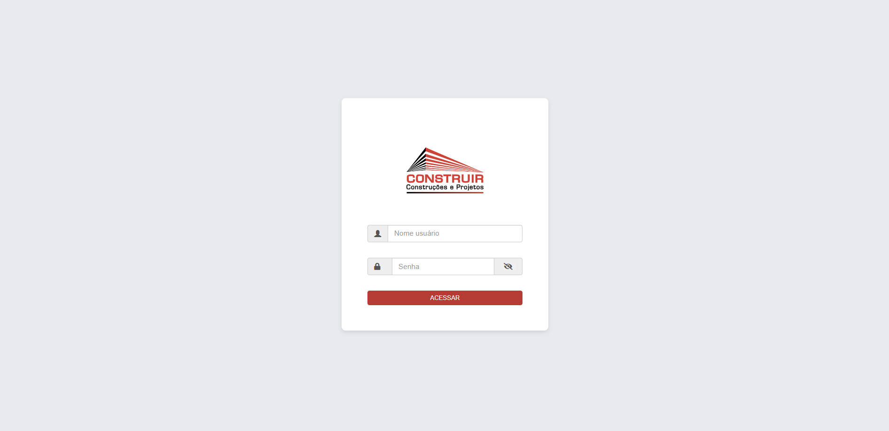
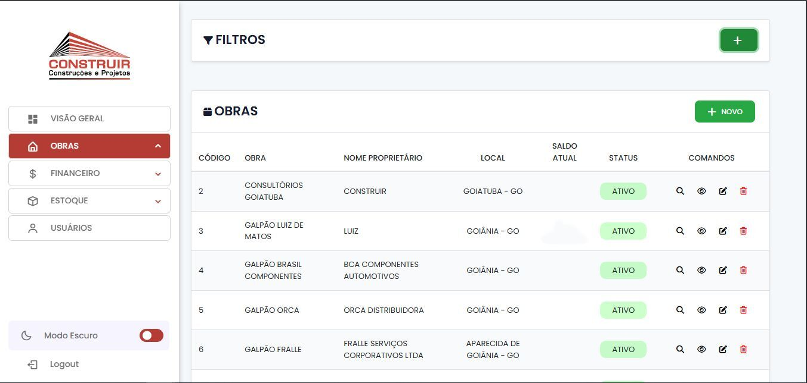
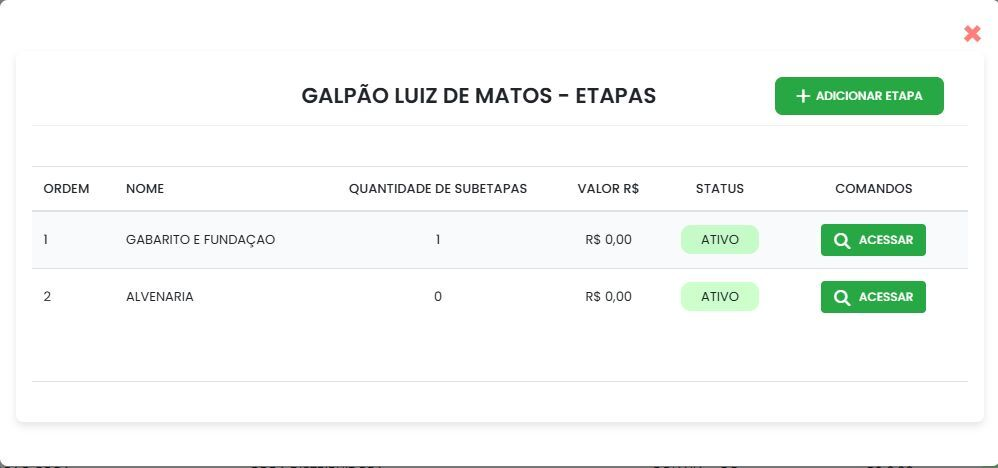
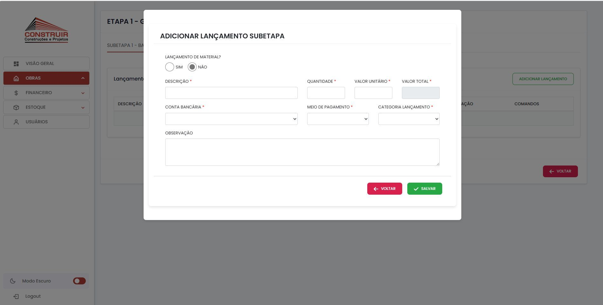
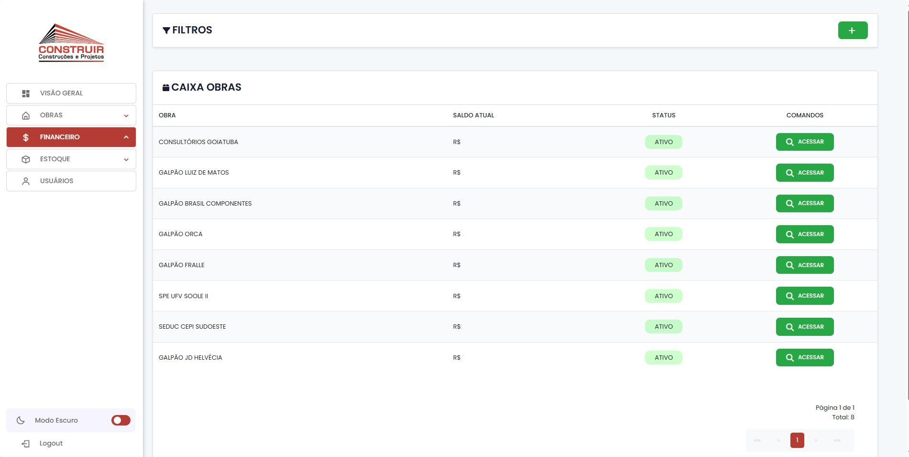
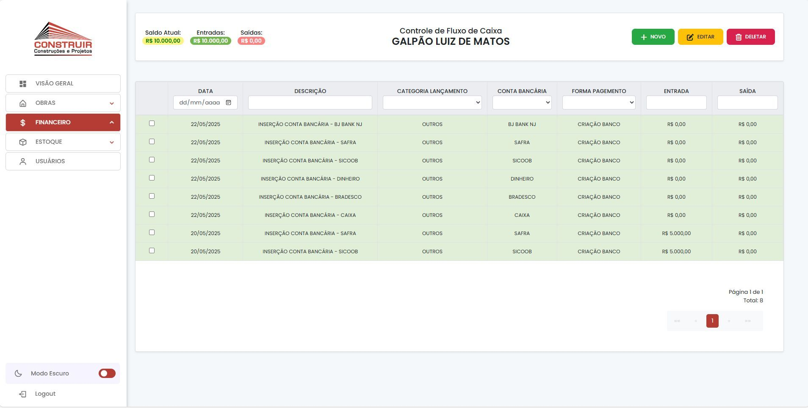
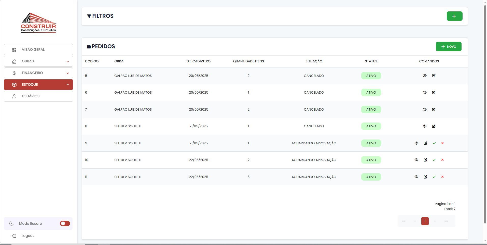
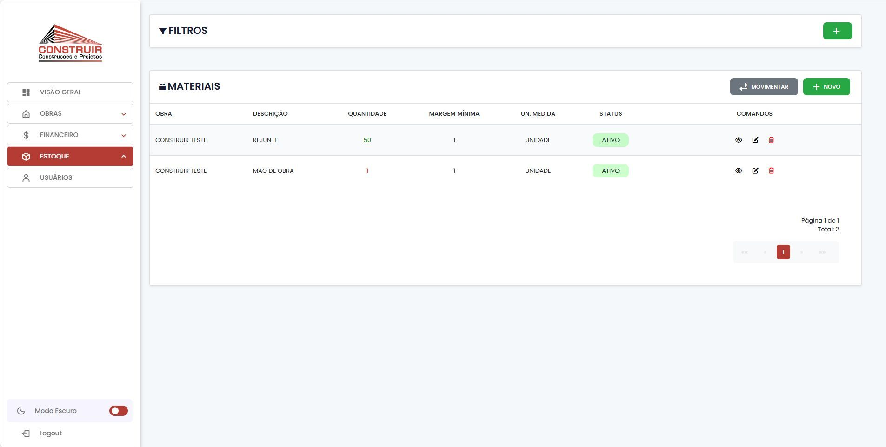

# 🏗️ Sistema de Gerenciamento de Obras

Transformando planilhas em tecnologia de verdade: este projeto foi desenvolvido para digitalizar e automatizar completamente a gestão de obras de uma construtora que sofria com retrabalho, descentralização de dados e falta de visibilidade gerencial.

---

## 🚧 Sobre o projeto

Este sistema foi desenvolvido sob medida para substituir o uso de planilhas na gestão de obras, trazendo **controle, eficiência e escalabilidade** para a operação da empresa.

O projeto foi realizado em parceria com o desenvolvedor **Paulo Vinícius Rodrigues Souza**, e tem como objetivo resolver os principais gargalos enfrentados por empresas do setor da construção civil, como:

- Falta de centralização das informações
- Dificuldade em acompanhar o andamento das obras
- Ausência de indicadores e relatórios em tempo real

---

## ✅ Principais entregas e benefícios

- **Centralização inteligente das informações das obras**  
  → Um painel único e seguro para visualizar tudo: etapas, subetapas, recursos e status.

- **Controle detalhado de cada etapa da obra**  
  → Custos, materiais, mão de obra, estoque — tudo separado e rastreável.

- **Relatórios gerenciais com visão estratégica**  
  → Dados em tempo real para tomada de decisão mais ágil e embasada.

- **Interface moderna, responsiva e intuitiva**  
  → Pensada para o canteiro de obras e o escritório, com foco na experiência do usuário.

---

## 📸 Prints do sistema

> 💡 Para exibir imagens, crie uma pasta chamada `assets/` na raiz do repositório e adicione seus prints de tela.  
> Abaixo um exemplo de como você pode organizá-las no README:

### 📋 Tela de Login

### 🧱 Obras

### 📊 Financeiro

### 📋 Estoque

---

## 🛠️ Tecnologias utilizadas

### Backend
- ASP.NET Core MVC + C#
- Entity Framework Core + LINQ
- PostgreSQL com Migrations

### Frontend
- Razor Views
- Bootstrap + jQuery + Font Awesome

### Infraestrutura
- Docker + Docker Compose
- Nginx + Certbot (SSL)
- Cloudflare
- Hospedagem em nuvem privada

---

## 🚀 Próximos passos

- Estruturação de pipelines CI/CD para automação de deploys
- Melhorias contínuas com novas funcionalidades e integrações

---

## 📈 Evolução contínua

O sistema segue em desenvolvimento ativo, com foco em manter a solução sempre **atualizada, robusta e alinhada com as melhores práticas de mercado**.

---

## 💡 Lições aprendidas

> Transformar processos manuais com tecnologia é muito mais do que digitalizar dados —  
> é abrir caminho para uma operação mais eficiente, estratégica e escalável.

---

## 👨‍💻 Autor

**Filipe Jacob**  
Desenvolvedor Full Stack em transição de carreira com foco em soluções reais de impacto para empresas.  
[🔗 LinkedIn](https://linkedin.com/in/filipe-jacob)

---

> **📬 Quer saber mais sobre como desenvolvemos o sistema ou usamos alguma das tecnologias?**  
> Fique à vontade para entrar em contato!

🇺🇸 //

# 🏗️ Construction Management System

From spreadsheets to automation: this project was developed to fully digitalize and streamline the construction management operations of a company that previously relied on spreadsheets — resulting in rework, data decentralization, lack of managerial visibility, and significant time loss.

---

## 🚧 About the project

This custom-built system was designed to replace manual spreadsheet-based processes in construction management, bringing **control, efficiency, and scalability** to the company's day-to-day operations.

The project was developed in collaboration with software engineer **Paulo Vinícius Rodrigues Souza**, with the goal of solving common bottlenecks in the construction industry, such as:

- Lack of centralized project information  
- Difficulty tracking project progress  
- No access to real-time data or strategic reports  

---

## ✅ Key deliveries and benefits

- **Smart centralization of construction data**  
  → A secure, unified dashboard to monitor everything: stages, sub-stages, resources, and progress.

- **Detailed control of each construction stage**  
  → Costs, materials, labor, stock — all tracked and organized independently.

- **Strategic reporting with real-time insights**  
  → Live data to support faster and more informed decision-making.

- **Modern, responsive and intuitive interface**  
  → Designed for both on-site and office use, with a strong focus on user experience.

---

## 📸 System screenshots

> 💡 To display images, create a folder named `assets/` in the root directory of this repository and place your screenshots there.  
> Below is an example of how to organize them in the README:

### 📋 Login Screen  

### 🧱 Construction Projects  
  
  

### 📊 Financial Module  
  

### 📋 Inventory Management  
  

---

## 🛠️ Technologies used

### Backend
- ASP.NET Core MVC + C#
- Entity Framework Core + LINQ
- PostgreSQL with Migrations

### Frontend
- Razor Views
- Bootstrap + jQuery + Font Awesome

### Infrastructure
- Docker + Docker Compose
- Nginx + Certbot (SSL)
- Cloudflare
- Private cloud hosting

---

## 🚀 Next steps

- Implementing CI/CD pipelines for automated deployments  
- Ongoing development of new features and system integrations

---

## 📈 Continuous improvement

The system is under active development, focused on keeping the platform **up-to-date, stable, and aligned with industry best practices**.

---

## 💡 Lessons learned

> Transforming manual processes with technology goes far beyond digitizing data —  
> it's about enabling a more efficient, strategic, and scalable operation.

---

## 👨‍💻 Author

**Filipe Jacob**  
Full Stack Developer in career transition, passionate about building impactful real-world solutions for businesses.  
[🔗 LinkedIn](https://linkedin.com/in/filipe-jacob)

---

> **📬 Curious about the technologies or the development process?**  
> Feel free to reach out — I'm happy to share more details!
